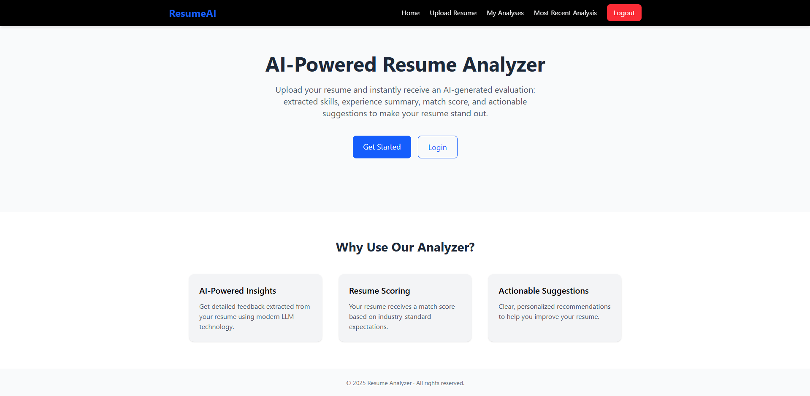
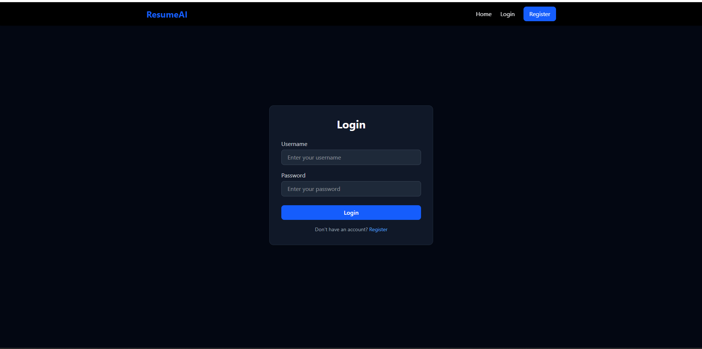
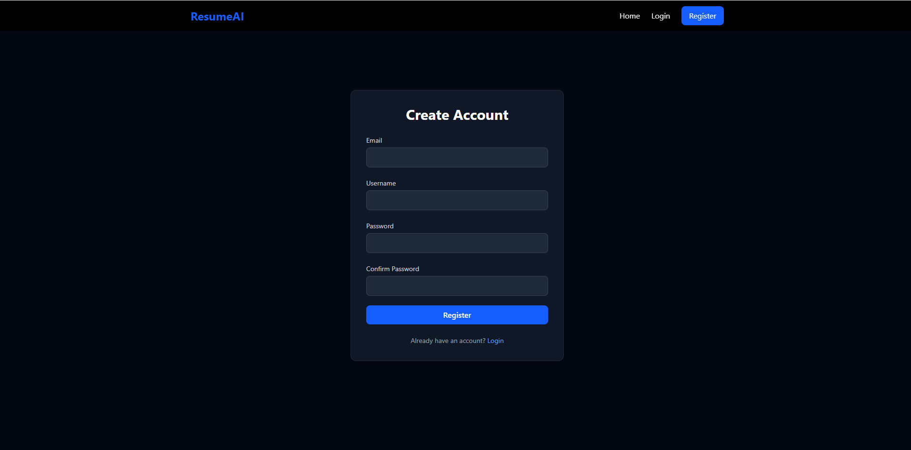
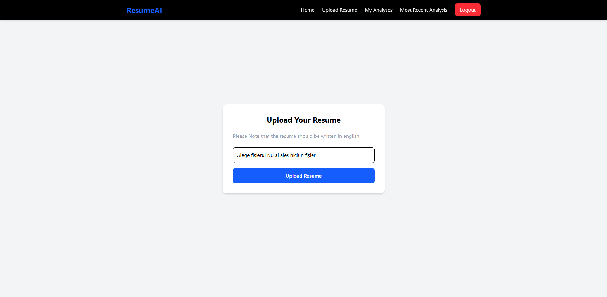
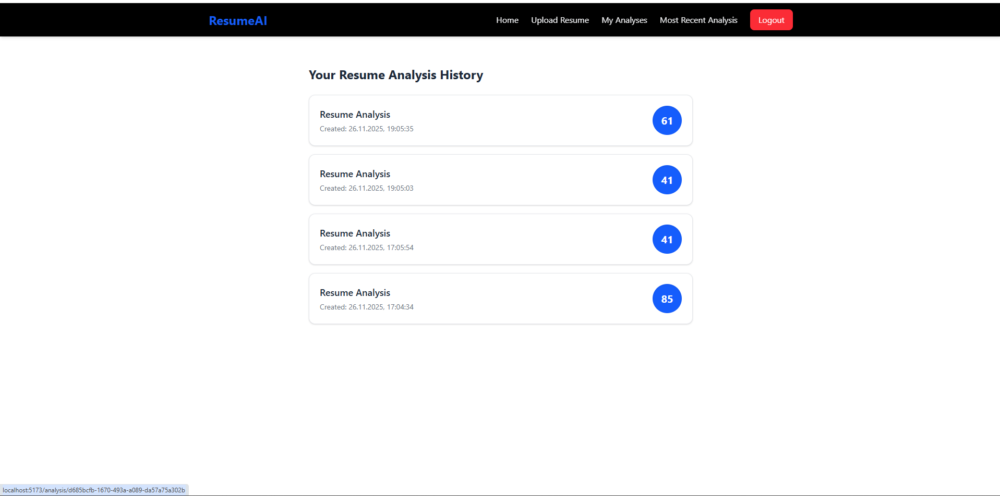
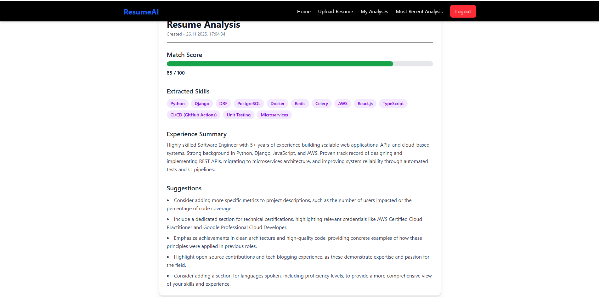

# Resume Analyzer API

A backend service that allows users to upload their PDF resumes and automatically generates an AI-powered analysis including:

- Extracted skills
- Experience summary
- Match score
- Actionable suggestions

Built with **Django REST Framework**, **PostgreSQL**, **Redis**, and **JWT authentication**, the API focuses on clean architecture, security, and performance.

---

## 📌 Features

### 🔐 User Authentication

- Registration & login using **JWT (SimpleJWT)**
- Protected endpoints for:
  - Resume uploads
  - Viewing resume analyses

---

### Resume Upload System

- Upload **PDF resumes** via `multipart/form-data`
- Robust validation layer:
  - ❌ File corruption detection
  - 📏 File size limits (**max 5MB**)
  - 🔁 Duplicate resume detection via **hashed content**
  - 🧾 Non-CV file rejection (regex-based CV detection on file text/metadata)

---

### AI-Powered Resume Analysis

- Uses an **LLM** to automatically extract:
  - Skills
  - Experience summary
  - Match score (**0–100**)
  - 4–5 detailed, actionable suggestions
- Analysis is generated **automatically via Django signals** after a successful upload

---

### Caching (Redis)

- Individual resume analyses are **cached** to speed up retrieval
- Automatic cache cleanup when an analysis is:
  - Updated
  - Deleted

---

### Rate Limiting

Custom throttling for resume uploads:

- **Burst limit:** `2 uploads / minute`
- **Sustained limit:** `100 uploads / day`

Implemented using DRF throttling classes to protect the API against abuse.

---

### Data Management

- Each user can store a **maximum of 10 resume analyses**
- When the limit is reached:
  - The **oldest resume** for that user is automatically deleted
  - Ensures storage efficiency and predictable resource usage

---

### API Documentation

- API schema & docs are auto-generated using **DRF Spectacular (OpenAPI 3)**
- Interactive documentation UI available (e.g. Swagger / Redoc) at:
  - `/api/schema/swagger-ui/`
  - `/api/schema/redoc/`
  - `/api/schema/` (raw OpenAPI schema)

---

## 🛠 Tech Stack

**Backend**

- [x] Django 5
- [x] Django REST Framework

**Database & Caching**

- [x] PostgreSQL
- [x] Redis via `django-redis`

**Authentication & Security**

- [x] JWT auth with **SimpleJWT**
- [x] Custom throttling & per-user limits
- [x] File validation & hashing

**Observability & Tooling**

- [x] **Silk** for profiling and performance monitoring
- [x] **DRF Spectacular** for API documentation
- [x] **PyMuPDF** for PDF text extraction
- [x] Regex-based validation utilities

---

## **Setup & Run Locally**

```bash
# 1 Clone the repository
git clone https://github.com/rares1215/Document_AI.git
cd backend

# 2 Create a virtual environment
python -m venv venv
source venv/bin/activate    # on Linux/Mac
venv\Scripts\activate       # on Windows

# 3 Install dependencies
pip install -r requirements.txt

# 4 Run migrations
python manage.py migrate

# 5 Start Redis (if using Docker)
docker run -p 6379:6379 redis

# 6 Run the development server
python manage.py runserver

```

---

# Frontend (React.js) — Overview

The frontend of the Resume Analyzer App is built with **React**, **Vite**, and **TailwindCSS**  
and provides a clean, minimalistic UI designed to highlight the analysis results clearly.

The UI includes:

- **Authentication pages** (Login + Register)
- **Resume upload interface**
- **Latest resume analysis**
- **Analysis history**
- **Full single-analysis detailed view**
- **Responsive Navbar**
- Smooth loading states & UX-friendly transitions

---

## Front-End Preview

| Page                         | Screenshot                                                             |
| ---------------------------- | ---------------------------------------------------------------------- |
| **Home**                     |                    |
| **Login**                    |                  |
| **Register**                 |            |
| **Upload Resume page**       |  |
| **History of Analyses Page** |              |
| **Analysis Page**            |            |

# Frontend Tech Stack

- **React 18**
- **Vite**
- **TailwindCSS**
- **Axios**
- **React Router v6**
- Reusable components (LoadingSpinner, Analysis Card, etc.)

The design philosophy follows:

- Minimal UI
- Clear information hierarchy
- ⚡ Fast response & loading feedback
- Fully responsive layouts

---

# Running the Frontend

```bash
cd frontend

# Install dependencies
npm install

# Create .env file
echo "VITE_API_URL=http://127.0.0.1:8000/" > .env

# Start dev server
npm run dev

```
